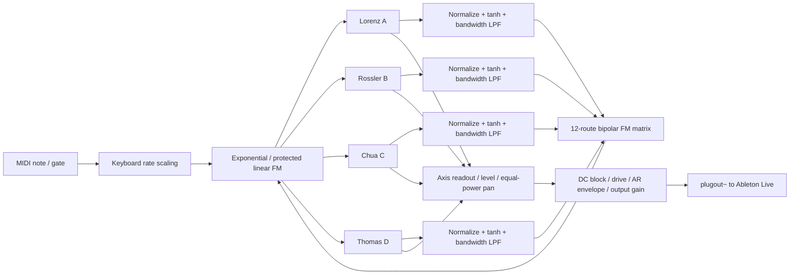

# CHAOS / FM4

**English** · [简体中文](README_zh-CN.md)

A Max for Live synthesizer built from four chaotic attractors that directly frequency-modulate one another.

CHAOS / FM4 uses the Lorenz, Rössler, Chua, and Thomas continuous-time dynamical systems as sound generators. Each attractor contributes to the stereo mix while its state signal modulates the running speed of the other attractors through a bipolar 4×4 matrix. The instrument provides exponential FM, floor-protected linear FM, Drone and MIDI modes, and constrained parameter randomization.

> This repository includes the ready-to-load [`Chaos_FM4.amxd`](Chaos_FM4.amxd) device and editable `.maxpat`, `.gendsp`, and JavaScript source files. Every performer-facing control uses a `live.*` object, so Live can store, map, and automate it.

## Features

- Four distinct three-dimensional chaotic systems: Lorenz, Rössler, Chua, and Thomas.
- 12 directed cross-FM routes arranged as a bipolar matrix.
- Exponential FM and linear FM with an adjustable minimum-rate safeguard.
- Independent Rate, Shape, X/Y/Z Axis, Level, and Pan for each attractor.
- Adjustable modulation bandwidth, from slow chaotic drift to audio-rate cross-modulation.
- Continuous Drone mode and monophonic MIDI mode.
- MIDI rate transposition with an Attack/Release envelope.
- Constrained randomization that produces sparse bipolar matrices while avoiding unsafe parameter regions.
- Invalid-state detection, automatic reset, DC blocking, soft saturation, and smoothed output gain.
- A two-page Max for Live Presentation UI that fits within a 169 px device height.
- 45 saved parameters, all represented by `live.*` UI objects.

## Signal Architecture



The modulation stage reads the four state signals saved during the previous sample, then updates all four systems. This gives the coupled network a symmetric one-sample delay and prevents the source-code order of A, B, C, and D from creating an unintended directional bias.

## Chaotic Systems

### A — Lorenz

$$
\dot{x}=\sigma(y-x),\qquad
\dot{y}=x(\rho-z)-y,\qquad
\dot{z}=xy-\beta z
$$

The implementation fixes $\sigma=10$ and $\beta=8/3$. `LORENZ Shape` controls $\rho$ from 20 to 38, with a default of 28.

### B — Rössler

$$
\dot{x}=-y-z,\qquad
\dot{y}=x+ay,\qquad
\dot{z}=b+z(x-c)
$$

The implementation fixes $a=b=0.2$. `ROSSLER Shape` controls $c$ from 4 to 9, with a default of 5.7.

### C — Chua

$$
\dot{x}=\alpha(y-x-h(x)),\qquad
\dot{y}=x-y+z,\qquad
\dot{z}=-\beta y
$$

The piecewise-linear function is written exactly as it appears in the source:

$$
h(x)=-1.143x+\frac{0.429}{2}(|x+1|-|x-1|)
$$

This form has an inner slope of -0.714 and an outer slope of -1.143; $\beta=28$. `CHUA Shape` controls $\alpha$ from 12 to 19, with a default of 15.6.

### D — Thomas

$$
\dot{x}=\sin(y)-bx,\qquad
\dot{y}=\sin(z)-by,\qquad
\dot{z}=\sin(x)-bz
$$

`THOMAS Shape` controls the damping coefficient $b$ from 0.15 to 0.28, with a default of 0.208.

## Direct Attractor-to-Attractor FM

FM changes how quickly an attractor travels through its trajectory. For system $i$:

$$
\frac{d\mathbf{s}_i}{dt}=r_i[n]F_i(\mathbf{s}_i)
$$

Here, $\mathbf{s}_i=(x_i,y_i,z_i)$ is the state, $F_i$ is the complete vector field, and $r_i$ is the modulated running rate. The same rate multiplier is applied to all three derivatives, so FM does not deliberately distort the coordinate proportions of the attractor.

Each attractor first reads its selected X, Y, or Z coordinate using a system-specific normalization:

| System | X normalization | Y normalization | Z normalization |
|---|---|---|---|
| Lorenz | $x/20$ | $y/25$ | $(z-25)/25$ |
| Rössler | $x/10$ | $y/10$ | $(z-8)/8$ |
| Chua | $x/2.5$ | $y/0.5$ | $z/4$ |
| Thomas | $x/2$ | $y/2$ | $z/2$ |

The normalized signal passes through `tanh` and a one-pole low-pass filter:

$$
m_i[n]=m_i[n-1]+\left(\tanh(q_i[n])-m_i[n-1]\right)
\left(1-e^{-2\pi f_b/f_s}\right)
$$

$f_b$ is `FM Bandwidth`, ranging from 0.1 to 1000 Hz, and $f_s$ is the sample rate. Low bandwidth values produce slow drift; high values retain audio-rate components from the attractor output.

### FM Matrix

Let $d_{ji}$ denote the matrix depth from source $j$ to destination $i$. The combined modulation for target $i$ is:

$$
u_i=\min\left(1,\max\left(-1,C\sum_{j\ne i}d_{ji}m_j\right)\right)
$$

$C$ is the global `FM Amount`. The diagonal is omitted, so this version does not provide self-FM. Every connection ranges from -1 to +1; its sign determines the modulation direction.

The default matrix forms a weak directed ring:

```text
A → D → C → B → A
```

### Exponential FM

$$
r_i=r_{0,i}\,2^{4u_i}
$$

At full matrix depth, the instantaneous rate can move by approximately ±4 octaves. Exponential mode always produces a positive rate and generally gives smoother spectral motion.

### Floor-Protected Linear FM

$$
r_i=r_{0,i}(1+4u_i)
$$

The linear expression can reach zero or become negative. Backward integration is usually unstable for dissipative attractors, so the engine applies this clamp before integration:

$$
r_i\leftarrow\min\left(350,\max\left(r_{\min},r_i\right)\right)
$$

`FM Floor` controls $r_{\min}$ from 0.1 to 50. The clamp creates a nonlinear corner when the rate reaches the floor, but prevents negative speed from rapidly destabilizing the internal state.

> `Rate` is a dynamical-system time scale, not a strict oscillator frequency. Chaotic trajectories generally have no single stable period. MIDI notes therefore transpose the overall running speed rather than guaranteeing equal-tempered pitch.

## Numerical Integration and Stability

The engine performs two explicit Euler substeps per audio sample. For system $i$, the total time step is:

$$
\Delta t_i=\min\left(0.008,\frac{r_i}{f_s}\right)
$$

Each substep uses $\Delta t_i/2$, and the final Rate is limited to 350. Two substeps provide a practical compromise between real-time cost and stability. This is an audio instrument, not a high-precision offline dynamical-system simulator; the integration method contributes to its sound.

Additional safeguards include:

- Per-system state-magnitude thresholds.
- A simultaneous reset of all four systems and modulation histories when any state exceeds its threshold.
- Rising-edge detection for `Reset`, preventing repeated reset on every sample while the control remains high.
- Fixed, attractor-specific coordinate normalization.
- Separate `tanh` limiting in the modulation and audio paths.
- Final `dcblock`, Drive saturation, and 20 ms output-gain smoothing.

## Audio Path

Each voice reads the selected Axis using this path:

```text
state coordinate
  → attractor-specific normalization
  → tanh waveshaping
  → Level
  → equal-power Pan
  → stereo sum
  → DC blocker
  → Drive tanh
  → Attack/Release envelope
  → smoothed Output gain
  → plugout~
```

`RUN` controls the envelope target but does not stop the dynamical systems. When sound is re-enabled, the trajectories continue from the states they reached during silence.

## Performance Modes

### Drone

`DRONE` ignores MIDI Gate and produces continuous sound while `RUN` is enabled. It is intended for drones, evolving textures, and parameter exploration.

### MIDI

`MIDI` reads pitch and velocity Gate from `notein`. Pitch scales the base rate of all four systems relative to MIDI note 60:

$$
r_{0,i}=\mathrm{Rate}_i\,2^{(N-60)/12}
$$

The current implementation is monophonic and uses the most recently received pitch. It does not include a polyphonic voice allocator. Attack ranges from 1 to 2000 ms; Release ranges from 5 to 5000 ms.

## Parameters

### Global Parameters

| Parameter | Range / options | Default | Function |
|---|---:|---:|---|
| Run | Off / On | On | Controls the output-envelope target |
| Play Mode | Drone / MIDI | Drone | Selects continuous or MIDI-gated operation |
| FM Mode | Exponential / Linear | Exponential | Selects the rate-modulation mapping |
| Randomize | Button | — | Generates a constrained parameter state |
| FM Amount | 0–1 | 0.35 | Scales the complete FM matrix |
| FM Bandwidth | 0.1–1000 Hz | 2 Hz | Low-pass bandwidth of the modulation signals |
| FM Floor | 0.1–50 Hz | 0.5 Hz | Minimum integration rate, primarily for linear FM |
| Drive | 0.25–6 | 1 | Soft-saturation amount after the stereo sum |
| Output | -60–0 dB | -18 dB | Final output gain |
| Reset | Off / On | Off | Resets the systems on a rising edge |

### Per Attractor

| Parameter | Range | Function |
|---|---:|---|
| Rate | 1–350 | Base time scale |
| Shape | System-specific | Controls the main bifurcation parameter |
| Axis | X / Y / Z | Selects the audio and modulation coordinate |
| Level | 0–1 | Voice level in the stereo mix |
| Pan | -1–1 | Equal-power stereo position |

### FM Matrix

The matrix exposes 12 parameters: `A to B`, `A to C`, `A to D`, and so on. Every route ranges from -1 to +1.

- Rows are modulation sources.
- Columns are modulation destinations.
- Zero disconnects a route.
- Positive and negative values produce opposite rate offsets.
- The diagonal is unavailable because self-FM is not implemented.

## Parameter Randomization

`RANDOMIZE` uses Max JavaScript to update the Live parameter objects, which forward their new values through the normal parameter connections to `gen~`. It randomizes:

- Global FM Amount, FM Bandwidth, and Drive.
- Rate, Shape, Level, Pan, and Axis for all four systems.
- The 12-route bipolar matrix; ordinary routes have approximately a 42% chance of being enabled.
- A guaranteed non-zero A→B→C→D→A ring, preventing a completely disconnected network.

Randomization uses constrained ranges and preserves Run, Play Mode, FM Mode, FM Floor, Output, Attack, and Release. After changing the parameters, it sends one Reset pulse to start the new configuration from deterministic initial conditions.

## Installation and Use

### Requirements

- Ableton Live with Max for Live.
- Max 9. The project has been validated with Max 9.1.3 at 44.1 kHz.
- Other Max versions and sample rates may work, but have not been formally verified.

### Add It to a Max for Live Device

Download the repository and keep `Chaos_FM4.amxd`, `chaos_fm4_engine.gendsp`, and `chaos_fm4_ui.js` together. Drag `Chaos_FM4.amxd` onto a MIDI track in Ableton Live, then select Drone or MIDI mode. The accompanying DSP and JavaScript files match the device's dependencies.

To work with the editable source patch:

1. Add an empty Max Instrument to a MIDI track in Ableton Live.
2. Click the device's edit button to open it in Max.
3. Open `Chaos_FM4.maxpat`, or copy its contents into the device editor.
4. Keep these three files in the same directory:
   - `Chaos_FM4.maxpat`
   - `chaos_fm4_engine.gendsp`
   - `chaos_fm4_ui.js`
5. Save your edited device into your Live User Library.

The main patch sends stereo audio back to Live through `plugout~`. All performance controls use `live.dial`, `live.menu`, `live.toggle`, `live.numbox`, or `live.text`.

## Suggested Starting Points

### Slowly Evolving Drone

```text
Play Mode       Drone
FM Mode         Exponential
FM Amount       0.15–0.35
FM Bandwidth    0.2–3 Hz
Drive           0.8–1.4
```

### Rough Audio-Rate Cross-Modulation

```text
FM Mode         Exponential
FM Amount       0.35–0.7
FM Bandwidth    100–1000 Hz
Matrix depth    ±0.1–0.5
Drive           1–2
```

### Linear FM Near the Rate Floor

```text
FM Mode         Linear
FM Floor        0.5–5 Hz
FM Amount       0.4–0.8
Matrix          Mix positive and negative depths
```

When a linear offset reaches `FM Floor`, an attractor temporarily moves at the minimum speed. This can create a rhythmic sense of near-stalling and release.

## Repository Structure

```text
Chaos_FM4/
├── Chaos_FM4.amxd               # Ready-to-load Max for Live instrument
├── Chaos_FM4.maxpat             # Main patch, Live UI, MIDI, and audio routing
├── chaos_fm4_engine.gendsp      # Attractors, integration, FM, and audio DSP
├── chaos_fm4_ui.js              # Page switching and constrained randomization
├── README.md                    # English GitHub documentation
├── README_zh-CN.md              # Full Simplified Chinese documentation
├── README_中文.md               # Short Simplified Chinese usage guide
├── VALIDATION.md                # Human-readable validation summary
├── tools/
│   └── build.py                 # Generates patches, DSP, UI, and test fixture
├── validation/
│   └── report.json              # Machine-readable runtime measurements
└── release/
    └── Chaos_FM4_Source.zip     # Minimal source release archive
```

## Validation

The current version has passed the following checks:

- Actual `gen~` compilation in Max 9.
- A six-channel runtime recording: stereo audio plus four modulation-monitor signals.
- Approximately 3.8 seconds of execution using linear FM, a 3 Hz Floor, maximum Coupling, and negative matrix depth.
- Non-silent output from both audio channels and all four modulation channels.
- No channel exceeded full scale, and no numerical divergence was detected.
- Static verification that all 45 saved parameters are backed by `live.*` controls.
- Visual inspection of both OSCILLATORS and FM MATRIX Presentation pages in Max.
- An actual Randomize trigger, confirming changes to voice parameters and the bipolar matrix.

See [`VALIDATION.md`](VALIDATION.md) and [`validation/report.json`](validation/report.json) for the recorded results.

## Known Limitations

- MIDI mode is monophonic and has no voice allocator.
- Chaotic Rate is not precise pitch; keyboard input scales the system time axes.
- The current matrix omits the four self-FM diagonal routes.
- The engine uses two Euler substeps rather than a higher-order solver. Extreme settings can still produce a distinct numerical character.
- The device runs in Max for Live; VST, AU, and standalone builds are not provided.
- No open-source license has been declared. Standard copyright restrictions apply until a license is added.

## Contributing

Issues and pull requests are welcome. Possible development directions include:

- Polyphonic voice allocation with independent chaotic state per note.
- Switchable RK2/RK4 integration alongside the current Euler implementation.
- Self-FM, matrix presets, matrix smoothing, and scene morphing.
- Optional oversampling with anti-aliasing downsampling.
- Trajectory visualization or a Jitter phase-space display.
- Reproducible random seeds and preset browsing.

When submitting DSP changes, update `tools/build.py`, regenerate the patches, and report the Max version, sample rate, and runtime test results.
