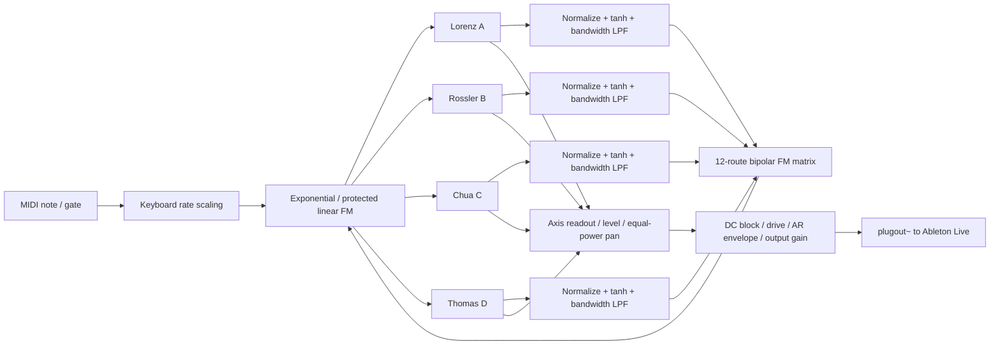

# CHAOS / FM4

[English](README.md) · **简体中文**

四个混沌吸引子直接互相 FM 的 Max for Live 合成器。

CHAOS / FM4 使用 Lorenz、Rössler、Chua 和 Thomas 四组连续时间动力系统作为声音核心。每个核心的状态既进入立体声混音，也通过一个 4×4 双极性矩阵调制其他核心的运行速度。项目提供指数 FM、带最低速率保护的线性 FM、Drone/MIDI 演奏模式，以及受约束的参数随机化。

> 本仓库提供可直接加载的 [`Chaos_FM4.amxd`](Chaos_FM4.amxd) 设备，以及可编辑的 `.maxpat`、`.gendsp` 和 JavaScript 源文件。所有面向演奏者的控件均使用 `live.*` 对象，可由 Live 保存、映射和自动化。

## 主要特性

- 四种不同的三维混沌系统：Lorenz、Rössler、Chua、Thomas。
- 12 路有方向的交叉 FM；矩阵的行是调制源，列是目标。
- 指数 FM 与带 `FM Floor` 下限保护的线性 FM。
- 每个核心独立的 Rate、Shape、X/Y/Z Axis、Level 和 Pan。
- 可调制带宽：从缓慢的混沌漂移到音频速率交叉调制。
- Drone 持续发声模式和单音 MIDI 模式。
- MIDI 模式带 Attack/Release 包络及键盘速率缩放。
- 受约束的随机化：生成稀疏双极性矩阵，同时避免危险的参数区域。
- 状态异常检测、自动复位、去直流、软饱和与输出平滑。
- 169 px 高的两页 Max for Live Presentation UI。
- 45 个可保存参数，全部由 `live.*` UI 对象提供。

## 信号架构



调制读取上一采样保存的四个状态信号，然后四个系统统一更新。这使互调关系保持对称，不会因为代码中 A、B、C、D 的计算顺序而产生额外的单向偏差。

## 四个吸引子

### A — Lorenz

$$
\dot{x}=\sigma(y-x),\qquad
\dot{y}=x(\rho-z)-y,\qquad
\dot{z}=xy-\beta z
$$

固定参数为 $\sigma=10$、$\beta=8/3$，界面中的 `LORENZ Shape` 控制 $\rho$，范围为 20–38，默认值为 28。

### B — Rössler

$$
\dot{x}=-y-z,\qquad
\dot{y}=x+ay,\qquad
\dot{z}=b+z(x-c)
$$

固定参数为 $a=b=0.2$，`ROSSLER Shape` 控制 $c$，范围为 4–9，默认值为 5.7。

### C — Chua

$$
\dot{x}=\alpha(y-x-h(x)),\qquad
\dot{y}=x-y+z,\qquad
\dot{z}=-\beta y
$$

其中分段线性函数按源码直接展开为：

$$
h(x)=-1.143x+\frac{0.429}{2}(|x+1|-|x-1|)
$$

该写法的内段斜率是 -0.714，外段斜率是 -1.143；$\beta=28$。`CHUA Shape` 控制 $\alpha$，范围为 12–19，默认值为 15.6。

### D — Thomas

$$
\dot{x}=\sin(y)-bx,\qquad
\dot{y}=\sin(z)-by,\qquad
\dot{z}=\sin(x)-bz
$$

`THOMAS Shape` 控制阻尼 $b$，范围为 0.15–0.28，默认值为 0.208。

## 直接吸引子 FM

这里的 FM 改变的是吸引子沿轨迹运动的时间尺度。对于第 $i$ 个系统：

$$
\frac{d\mathbf{s}_i}{dt}=r_i[n]F_i(\mathbf{s}_i)
$$

$\mathbf{s}_i=(x_i,y_i,z_i)$ 是系统状态，$F_i$ 是完整向量场，$r_i$ 是被调制后的运行速率。三个导数始终使用相同的速率系数，因此 FM 本身不会故意扭曲吸引子的坐标比例。

每个吸引子先从选定的 X、Y 或 Z 坐标得到归一化信号，再经过 `tanh` 限幅和一阶低通：

| 系统 | X 归一化 | Y 归一化 | Z 归一化 |
|---|---|---|---|
| Lorenz | $x/20$ | $y/25$ | $(z-25)/25$ |
| Rössler | $x/10$ | $y/10$ | $(z-8)/8$ |
| Chua | $x/2.5$ | $y/0.5$ | $z/4$ |
| Thomas | $x/2$ | $y/2$ | $z/2$ |

$$
m_i[n]=m_i[n-1]+\left(\tanh(q_i[n])-m_i[n-1]\right)
\left(1-e^{-2\pi f_b/f_s}\right)
$$

其中 $f_b$ 是 `FM Bandwidth`，范围 0.1–1000 Hz；$f_s$ 是采样率。较低的带宽产生缓慢漂移，较高的带宽保留吸引子输出中的音频速率成分。

### FM 矩阵

矩阵参数记作 $d_{ji}$，表示来源 $j$ 调制目标 $i$。对目标 $i$：

$$
u_i=\operatorname{clamp}\left(
C\sum_{j\ne i}d_{ji}m_j,-1,1
\right)
$$

$C$ 是全局 `FM Amount`。矩阵对角线被省略，因此当前版本没有自 FM。每个连接的范围是 -1 到 +1；正负号决定调制方向。

默认矩阵是一条弱环：

```text
A → D → C → B → A
```

### 指数 FM

$$
r_i=r_{0,i}\,2^{4u_i}
$$

满幅矩阵调制对应最多约 ±4 个八度的瞬时速度变化。指数模式始终产生正速率，适合较连续的频谱运动。

### 带下限保护的线性 FM

$$
r_i=r_{0,i}(1+4u_i)
$$

线性表达式可以得到零或负值。耗散型吸引子倒向积分通常不稳定，因此积分前统一执行：

$$
r_i\leftarrow\operatorname{clamp}(r_i,r_{\min},350)
$$

$r_{\min}$ 由 `FM Floor` 控制，范围 0.1–50。这个保护会在到达下限时形成非线性折点，但可避免负速率造成状态快速发散。

> `Rate` 表示动力系统的时间尺度，不是严格的振荡频率。混沌轨迹通常没有单一稳定周期，因此 MIDI 音符与 Rate 的关系是整体速率换算，而不是保证音高锁定。

## 数值积分与稳定策略

每个音频采样执行两个显式 Euler 子步。第 $i$ 个系统的总时间步长为：

$$
\Delta t_i=\min\left(0.008,\frac{r_i}{f_s}\right)
$$

每个子步使用 $\Delta t_i/2$。Rate 的最终上限是 350。两子步设计在计算成本和实时稳定性之间取平衡，也构成声音特性的一部分；它不是高精度离线动力学模拟器。

额外保护包括：

- 针对四个系统分别设置状态幅度阈值。
- 任一状态超出阈值时同时重置四个系统和四路调制历史。
- `Reset` 使用上升沿检测，不会在按钮保持开启时逐采样复位。
- 吸引子坐标使用系统专属的固定尺度归一化。
- 调制路径和音频路径分别使用 `tanh`，避免异常峰值直接传播。
- 最终混音经过 `dcblock`、Drive 软饱和与 20 ms 输出增益平滑。

## 音频路径

每个核心从所选 Axis 读取声音：

```text
state coordinate
  → attractor-specific normalization
  → tanh waveshaping
  → Level
  → equal-power Pan
  → stereo sum
  → DC blocker
  → Drive tanh
  → Attack/Release envelope
  → smoothed Output gain
  → plugout~
```

`RUN` 控制包络目标，但不会停止动力系统更新。因此重新打开声音时，轨迹会从静音期间继续演化后的位置出现。

## 演奏模式

### Drone

`DRONE` 模式忽略 MIDI Gate，只要 `RUN` 开启就持续发声，适合持续音、反馈纹理和参数探索。

### MIDI

`MIDI` 模式读取 `notein` 的音高与力度 Gate。音高相对 MIDI 60 缩放四个系统的基础 Rate：

$$
r_{0,i}=\mathrm{Rate}_i\,2^{(N-60)/12}
$$

当前实现是单音、最后音符优先的结构，没有复音分配器。Attack 范围 1–2000 ms，Release 范围 5–5000 ms。

## 参数说明

### 全局参数

| 参数 | 范围/选项 | 默认值 | 作用 |
|---|---:|---:|---|
| Run | Off / On | On | 控制输出包络目标 |
| Play Mode | Drone / MIDI | Drone | 选择持续发声或 MIDI Gate |
| FM Mode | Exponential / Linear | Exponential | 选择速率调制映射 |
| Randomize | Button | — | 生成新的受约束参数组合 |
| FM Amount | 0–1 | 0.35 | 缩放整个 FM 矩阵 |
| FM Bandwidth | 0.1–1000 Hz | 2 Hz | 调制信号低通带宽 |
| FM Floor | 0.1–50 Hz | 0.5 Hz | 最低积分速率，主要保护线性 FM |
| Drive | 0.25–6 | 1 | 最终混音软饱和强度 |
| Output | -60–0 dB | -18 dB | 最终输出增益 |
| Reset | Off / On | Off | 在上升沿重置动力系统 |

### 每个吸引子

| 参数 | 范围 | 作用 |
|---|---:|---|
| Rate | 1–350 | 基础时间尺度 |
| Shape | 依系统而定 | 控制主要分岔参数 |
| Axis | X / Y / Z | 选择音频及调制读取坐标 |
| Level | 0–1 | 声部进入立体声混音的电平 |
| Pan | -1–1 | 等功率声像 |

### FM Matrix

矩阵共有 12 个参数：`A to B`、`A to C`、`A to D`，依此类推。所有连接范围均为 -1 到 +1。

- 行：调制来源。
- 列：调制目标。
- 0：断开该连接。
- 正值/负值：相反的速率偏移方向。
- 对角线：不提供自调制。

## 参数随机化

`RANDOMIZE` 使用 Max JavaScript 更新 Live 参数，并立即通过原有参数连线发送到 `gen~`。随机化包含：

- 全局 FM Amount、FM Bandwidth 和 Drive。
- 四个系统的 Rate、Shape、Level、Pan 和 Axis。
- 12 路双极性矩阵；一般连接以约 42% 的概率启用。
- A→B→C→D→A 环形连接始终获得非零深度，避免生成完全断开的网络。

随机化使用经过限制的范围，不会改变 Run、Play Mode、FM Mode、FM Floor、Output、Attack 或 Release。随机化完成后会向引擎发送一次 Reset，使新参数从确定的初始状态开始。

## 安装和使用

### 要求

- Ableton Live，带 Max for Live。
- Max 9。项目已在 Max 9.1.3、44.1 kHz 下验证。
- 其他 Max 版本和采样率可能可用，但尚未形成正式兼容性结论。

### 加入 Max for Live 设备

下载仓库后，将 `Chaos_FM4.amxd`、`chaos_fm4_engine.gendsp` 和 `chaos_fm4_ui.js` 保持在同一文件夹。把 `Chaos_FM4.amxd` 拖入 Ableton Live 的 MIDI 轨道，选择 Drone 或 MIDI 模式即可使用。随附的 DSP 和 JavaScript 文件与设备依赖一致。

如需编辑源码补丁：

1. 在 Ableton Live 的 MIDI 轨道加入一个空白 Max Instrument。
2. 点击设备标题栏中的编辑按钮，在 Max 中打开设备。
3. 打开本仓库的 `Chaos_FM4.maxpat`，或将其内容复制到设备编辑窗口。
4. 将下列三个文件保持在同一目录：
   - `Chaos_FM4.maxpat`
   - `chaos_fm4_engine.gendsp`
   - `chaos_fm4_ui.js`
5. 将修改后的设备另存到自己的 Live User Library。

主补丁通过 `plugout~` 将立体声送回 Live。所有面向演奏的参数均由 `live.dial`、`live.menu`、`live.toggle`、`live.numbox` 或 `live.text` 实现。

## 推荐起点

### 缓慢演化的 Drone

```text
Play Mode       Drone
FM Mode         Exponential
FM Amount       0.15–0.35
FM Bandwidth    0.2–3 Hz
Drive           0.8–1.4
```

### 粗糙的音频速率互调

```text
FM Mode         Exponential
FM Amount       0.35–0.7
FM Bandwidth    100–1000 Hz
Matrix depth    ±0.1–0.5
Drive           1–2
```

### 带停滞边缘的线性 FM

```text
FM Mode         Linear
FM Floor        0.5–5 Hz
FM Amount       0.4–0.8
Matrix          同时使用正负深度
```

当线性偏移触及 FM Floor 时，某个吸引子会暂时以最低速率移动，产生接近停滞后再次释放的节奏感。

## 项目结构

```text
Chaos_FM4/
├── Chaos_FM4.amxd               # 可直接加载的 Max for Live 乐器
├── Chaos_FM4.maxpat             # 主补丁、Live UI、MIDI 和音频路由
├── chaos_fm4_engine.gendsp      # 四个吸引子、积分器、FM 与混音 DSP
├── chaos_fm4_ui.js              # 页面切换与受约束随机化
├── README.md                    # 英文 GitHub 项目说明
├── README_zh-CN.md              # 完整简体中文说明
├── README_中文.md               # 简版中文使用说明
├── VALIDATION.md                # 人类可读验证摘要
├── tools/
│   └── build.py                 # 生成补丁、Gen DSP、UI 脚本和测试夹具
├── validation/
│   └── report.json              # 机器可读测试测量
└── release/
    └── Chaos_FM4_Source.zip     # 最小源码发布包
```

## 开发

`tools/build.py` 是生成文件的主要来源。修改构建脚本后运行：

```bash
python3 tools/build.py
```

它会重新生成：

- `Chaos_FM4.maxpat`
- `chaos_fm4_engine.gendsp`
- `chaos_fm4_ui.js`
- `Runtime_Test.maxpat`
- `runtime_test.js`

因此，对上述生成文件的直接修改可能在下次构建时被覆盖。算法改动应优先写入 `tools/build.py` 中的 GenExpr 源码和补丁生成逻辑。

## 验证

当前版本完成了以下检查：

- Max 9 中实际编译 `gen~`。
- 录制 6 通道测试：立体声输出加四路调制监测信号。
- 在线性 FM、3 Hz Floor、最大 Coupling 和负向矩阵深度条件下运行约 3.8 秒。
- 两个音频通道和四个调制通道均为非静音。
- 没有通道超过满幅，没有检测到数值发散。
- 静态检查确认 45 个保存参数全部对应 `live.*` 控件。
- 在 Max Presentation Mode 中检查 OSCILLATORS 和 FM MATRIX 两个页面。
- 实际触发 Randomize，并确认声部参数和双极性矩阵发生变化。

详细结果见 [`VALIDATION.md`](VALIDATION.md) 和 [`validation/report.json`](validation/report.json)。

## 已知限制

- MIDI 模式是单音结构，没有复音分配。
- 混沌 Rate 不是准确音高，键盘只缩放系统时间尺度。
- 当前矩阵不包含四条自 FM 对角线。
- 使用两次 Euler 子步而非高阶积分器；极端参数仍可能产生明显的数值音色。
- 设备运行于 Max for Live，尚未提供 VST、AU 或独立应用版本。
- 项目尚未声明开源许可证；在添加许可证之前，默认版权规则仍然适用。

## 贡献

欢迎提交 Issue 或 Pull Request。适合继续开发的方向包括：

- 复音语音分配与每音符独立的混沌状态。
- RK2/RK4 与当前 Euler 实现之间的可切换积分器。
- 自 FM、矩阵预设、矩阵平滑和场景变形。
- 可选过采样与抗混叠降采样。
- 输出轨迹可视化或 Jitter 相空间显示。
- 可复现的随机种子和预设浏览系统。

提交 DSP 改动时，请同时更新 `tools/build.py`、重新生成补丁，并记录 Max 版本、采样率及运行测试结果。
